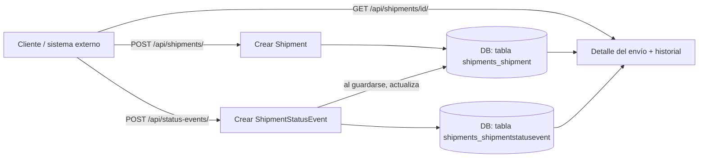

# Cómo funciona Hound Express (backend)

Documento de referencia para entender qué hace el proyecto, cómo está armado por dentro
y qué rutas/navegación tiene la API. Es un complemento del [README.md](README.md), que
se enfoca en instalación y comandos.

## 1. Alcance de este entregable

Esta parte del proyecto es **solo backend**: un servicio Django + API REST que administra
el estatus de los envíos de Hound Express y lo guarda en base de datos. **No se pide
frontend** — no hay plantillas HTML de cara al usuario ni interfaz visual propia; la
única "interfaz" es:

- La API REST (`/api/...`), pensada para que la consuma otro sistema (o un frontend futuro).
- El panel de administración de Django (`/admin/`), que sirve para gestionar los datos a
  mano, no es la entrega en sí.

## 2. Qué problema resuelve

Hound Express necesita un lugar centralizado donde:

1. Se registre cada envío (`Shipment`) con remitente, destinatario y peso.
2. Se vaya guardando el historial de eventos de estatus de ese envío
   (`ShipmentStatusEvent`): creado → recolectado → en tránsito → en reparto → entregado
   (o intento fallido / devuelto / cancelado).
3. El estatus "actual" del envío se pueda consultar rápido, sin tener que recorrer todo
   el historial cada vez.

## 3. Flujo de datos



Punto clave del diseño: **`ShipmentStatusEvent.save()` actualiza automáticamente**
`Shipment.current_status`. Es decir, nunca actualizas el estatus de un envío a mano;
lo haces creando un evento nuevo, y el envío "se entera solo". Esto está en
[shipments/models.py](shipments/models.py):

```python
def save(self, *args, **kwargs):
    super().save(*args, **kwargs)
    self.shipment.current_status = self.status
    self.shipment.save(update_fields=['current_status', 'updated_at'])
```

Así el historial completo queda en `ShipmentStatusEvent` (para consultas futuras) y el
estatus "de un vistazo" queda cacheado en `Shipment.current_status` (para no tener que
calcularlo cada vez que alguien pide la lista de envíos).

## 4. Estructura de carpetas

```
hound_express/       # Configuración del proyecto (settings, urls raíz, wsgi/asgi)
shipments/            # La app con toda la lógica de negocio
  models.py            # Shipment y ShipmentStatusEvent
  serializers.py        # Traducen los modelos a/desde JSON para la API
  views.py               # ViewSets: qué hace cada endpoint
  urls.py                  # Rutas de la app, registradas con un router de DRF
  admin.py                  # Qué se ve y cómo en /admin/
  migrations/                # Historial de cambios a la base de datos
manage.py             # Punto de entrada de comandos de Django
requirements.txt      # Dependencias
Dockerfile / docker-compose.yml   # Para correrlo en contenedor
```

## 5. Mapa de navegación / endpoints

Todo bajo el prefijo `/api/` (definido en [hound_express/urls.py](hound_express/urls.py),
que incluye [shipments/urls.py](shipments/urls.py)).

| Método | Ruta                                    | Qué hace                                                   |
|--------|-------------------------------------------|---------------------------------------------------------------|
| GET    | `/api/shipments/`                         | Lista todos los envíos (paginado, 20 por página)               |
| POST   | `/api/shipments/`                         | Crea un envío nuevo (genera `tracking_number` automático)      |
| GET    | `/api/shipments/{id}/`                    | Detalle de un envío, incluye su historial completo de estatus  |
| PATCH  | `/api/shipments/{id}/`                    | Actualiza datos del envío (no el estatus directamente)         |
| DELETE | `/api/shipments/{id}/`                    | Elimina un envío (y sus eventos, por el `on_delete=CASCADE`)   |
| GET    | `/api/shipments/{id}/status_history/`     | Solo el historial de estatus de ese envío                      |
| GET    | `/api/status-events/`                     | Lista todos los eventos de estatus (de todos los envíos)       |
| POST   | `/api/status-events/`                     | Registra un evento nuevo → actualiza el estatus del envío      |
| GET    | `/api/status-events/?shipment={id}`       | Filtra eventos de un envío específico                          |

Rutas fuera de `/api/`:

| Ruta          | Qué es                                                        |
|----------------|------------------------------------------------------------------|
| `/admin/`       | Panel de administración de Django (gestión manual de los datos) |
| `/api-auth/`    | Login/logout de la sesión del navegador para probar la API desde `/api/` con la interfaz navegable de DRF |

Cómo se arma esto por dentro: [shipments/urls.py](shipments/urls.py) usa un
`DefaultRouter` de DRF, que a partir de un `ViewSet` genera automáticamente las 6 rutas
típicas de un CRUD (list, create, retrieve, update, partial_update, destroy), más
las acciones extra que se marcan con `@action` (como `status_history`).

## 6. Ejemplo de flujo completo (paso a paso)

1. `POST /api/shipments/` con los datos del envío → responde con el envío creado,
   `current_status: "created"` y un `tracking_number` generado (ej. `HEDD689F624F`).
2. `POST /api/status-events/` con `{"shipment": 1, "status": "picked_up", ...}` →
   se guarda el evento y, automáticamente, el envío 1 pasa a `current_status: "picked_up"`.
3. `GET /api/shipments/1/` → devuelve el envío con su estatus actual **y** el arreglo
   `status_events` con todo el historial (en este caso, un evento).
4. Se repite el paso 2 cada vez que el envío cambia de estatus (en tránsito, entregado, etc.).

## 7. Cómo correrlo

Ver el [README.md](README.md) para el detalle de comandos. En resumen:

- **Local (venv):** `venv\Scripts\activate` → `python manage.py runserver`
- **Docker:** `docker compose up --build`

Ambas formas levantan lo mismo en `http://localhost:8000/`.
