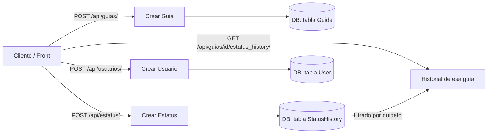

# Cómo funciona Hound Express (backend)

Documento de referencia para entender qué hace el proyecto, cómo está armado por dentro
y qué rutas/navegación tiene la API. Es un complemento del [README.md](README.md), que
se enfoca en instalación y comandos.

## 1. Alcance de este entregable

Esta parte del proyecto es **solo backend**: las entidades de base de datos de Hound
Express (guías, historial de estatus, usuarios) y la API REST para leerlas/escribirlas.
**No se pide frontend** — no hay plantillas HTML de cara al usuario ni interfaz visual
propia; la única "interfaz" es:

- La API REST (`/api/...`), pensada para que la consuma la aplicación Front y así
  presentar el detalle de cada envío.
- El panel de administración de Django (`/admin/`), que sirve para gestionar los datos
  a mano, no es la entrega en sí.

## 2. Qué problema resuelve

Hound Express necesita un lugar centralizado donde:

1. Se registre cada guía/envío (`Guia`, tabla `Guide`) con su número de rastreo,
   origen, destino y estatus actual.
2. Se vaya guardando el historial de eventos de estatus de esa guía
   (`Estatus`, tabla `StatusHistory`), incluyendo quién lo actualizó.
3. Se sepa qué usuarios (`Usuario`, tabla `User`) pueden realizar esas actualizaciones.

A diferencia de otras partes del curso, aquí las 3 entidades son **planas e
independientes entre sí a nivel de Django**: `Estatus.guideId` guarda el id de la
`Guia` relacionada como un entero simple (no un `ForeignKey` de Django), replicando
tal cual el diseño de base de datos pedido en la consigna.

## 3. Flujo de datos


```mermaid
flowchart LR
    A[Cliente / Front] -- POST /api/guias/ --> B[Crear Guia]
    B --> C[(DB: tabla Guide)]
    A -- POST /api/estatus/ --> D[Crear Estatus]
    D --> E[(DB: tabla StatusHistory)]
    A -- GET /api/guias/id/estatus_history/ --> F[Historial de esa guía]
    E -- filtrado por guideId --> F
    A -- POST /api/usuarios/ --> G[Crear Usuario]
    G --> H[(DB: tabla User)]
```

Punto clave del diseño: a diferencia de una relación con `ForeignKey`, aquí **nadie
actualiza `Guia.currentStatus` automáticamente** al crear un `Estatus` — son tablas
independientes. Si quieres que el estatus "actual" de la guía refleje el último
evento, hoy tienes que actualizarlo tú explícitamente con un `PATCH /api/guias/{id}/`
(o agregar esa lógica más adelante, por ejemplo con una señal `post_save` como la que
se explica en [docs/14](docs/14-modelos-y-migraciones.md#señales-signals)).

## 4. Estructura de carpetas

```
hound_express/       # Configuración del proyecto (settings, urls raíz, wsgi/asgi)
shipments/            # La app con toda la lógica de negocio
  models.py            # Guia, Estatus, Usuario + el campo custom AutoDateTimeField
  serializers.py        # Traducen los modelos a/desde JSON para la API
  views.py               # ViewSets: qué hace cada endpoint
  urls.py                  # Rutas de la app, registradas con un router de DRF
  admin.py                  # Qué se ve y cómo en /admin/
  migrations/                # Historial de cambios a la base de datos
manage.py             # Punto de entrada de comandos de Django
requirements.txt      # Dependencias
Dockerfile / docker-compose.yml   # Para correrlo en contenedor
```

## 5. Mapa de navegación / endpoints

Todo bajo el prefijo `/api/` (definido en [hound_express/urls.py](hound_express/urls.py),
que incluye [shipments/urls.py](shipments/urls.py)).

| Método | Ruta                                    | Qué hace                                                   |
|--------|-------------------------------------------|---------------------------------------------------------------|
| GET    | `/api/guias/`                             | Lista todas las guías                                          |
| POST   | `/api/guias/`                             | Crea una guía nueva (`id` va explícito, no es autoincremental) |
| GET    | `/api/guias/{id}/`                        | Detalle de una guía                                             |
| PATCH  | `/api/guias/{id}/`                        | Actualiza datos de una guía (incluido `currentStatus`)          |
| DELETE | `/api/guias/{id}/`                        | Elimina una guía                                                |
| GET    | `/api/guias/{id}/estatus_history/`        | Historial de estatus de esa guía (filtra `Estatus` por `guideId`) |
| GET    | `/api/estatus/`                           | Lista todos los eventos de estatus (de todas las guías)         |
| POST   | `/api/estatus/`                           | Registra un evento nuevo de estatus                             |
| GET    | `/api/estatus/?guideId={id}`              | Filtra eventos de estatus de una guía específica                |
| GET    | `/api/usuarios/`                          | Lista usuarios                                                   |
| POST   | `/api/usuarios/`                          | Crea un usuario (`password` solo se acepta al escribir, nunca se devuelve) |
| GET/PATCH/DELETE | `/api/usuarios/{id}/`            | Detalle / actualizar / eliminar un usuario                       |

Rutas fuera de `/api/`:

| Ruta          | Qué es                                                        |
|----------------|------------------------------------------------------------------|
| `/admin/`       | Panel de administración de Django (gestión manual de los datos) |
| `/api-auth/`    | Login/logout de la sesión del navegador para probar la API desde `/api/` con la interfaz navegable de DRF |

Cómo se arma esto por dentro: [shipments/urls.py](shipments/urls.py) usa un
`DefaultRouter` de DRF, que a partir de un `ViewSet` genera automáticamente las 6 rutas
típicas de un CRUD (list, create, retrieve, update, partial_update, destroy), más
las acciones extra que se marcan con `@action` (como `estatus_history`).

## 6. Ejemplo de flujo completo (paso a paso)

1. `POST /api/guias/` con `{"id": 1, "trackingNumber": "HE0000001", "origin": "CDMX", "destination": "GDL", "currentStatus": "created"}`
   → crea la guía.
2. `POST /api/estatus/` con `{"id": 1, "guideId": 1, "status": "picked_up", "updatedBy": "operador1"}`
   → registra el evento (independiente de la guía; no la modifica).
3. `GET /api/guias/1/estatus_history/` → devuelve todos los eventos de `Estatus` cuyo
   `guideId` sea 1.
4. Si quieres que `currentStatus` de la guía refleje ese último evento,
   `PATCH /api/guias/1/` con `{"currentStatus": "picked_up"}`.

## 7. Detalle técnico: por qué existe `AutoDateTimeField`

Django no trae un campo llamado `AutoDateTimeField` — lo definimos nosotros en
[shipments/models.py](shipments/models.py) porque la consigna pide ese nombre
exacto para `updatedAt`/`timestamp`, con un comportamiento equivalente a
`auto_now=True` (se actualiza solo en cada `.save()`), pero declarado como una clase
propia en vez de usar la opción incorporada de Django. Ver también
[docs/14](docs/14-modelos-y-migraciones.md#señales-signals) para la explicación de
`pre_save`, que es justo el mecanismo que usa este campo por debajo.

Nota aparte: `createdAt` es un `DateField(default=timezone.now)` tal cual pide la
consigna — como `timezone.now()` regresa un `datetime` y no una `date`, el serializer
recarga la instancia desde la base de datos justo después de crearla
(`instance.refresh_from_db()` en `GuiaSerializer.create()`/`UsuarioSerializer.create()`)
para evitar un error de DRF al devolver la respuesta.

## 8. Cómo correrlo

Ver el [README.md](README.md) para el detalle de comandos. En resumen:

- **Local (venv):** `venv\Scripts\activate` → `python manage.py runserver`
- **Docker:** `docker compose up --build`

Ambas formas levantan lo mismo en `http://localhost:8000/`.
