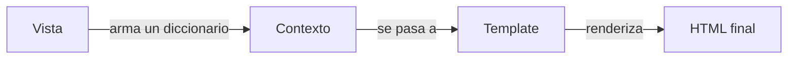

# 21 — Django Templates: herencia, bloques, ciclos y filtros (Módulo 60 de la plataforma)

Temas: el lenguaje de templates de Django a fondo — herencia (``),
bloques (``), ``, ciclos `` (con `forloop` y
`cycle`), filtros (`|title`, `|add`, etc.), y cómo llegan las variables desde la
vista hasta el template vía el contexto.

Ya habíamos tocado ``/`` por encima en
[docs/16](16-usuarios-personalizados-y-templates.md#meta-tags-y-el-template-base-layouthtml)
para explicar meta tags. Este módulo es el lenguaje de templates completo — aquí va
la referencia a fondo.

## Glosario del módulo

| Término | Definición corta | Dónde se explica aquí |
|---------|--------------------|---------------------------|
| **Bloque** | Sección de un template base que otro template puede sobrescribir | [Herencia, extender y bloques](#herencia-extender-y-bloques) |
| **Ciclo for** | Estructura para iterar listas dentro del template | [Ciclo for a fondo](#ciclo-for-a-fondo) |
| **Contexto** | Diccionario de datos que la vista le pasa al template | [Vista → Contexto → Template](#vista--contexto--template) |
| **Extender** | Crear un template nuevo basado en uno existente | [Herencia, extender y bloques](#herencia-extender-y-bloques) |
| **Filtro** | Función que transforma cómo se muestra un dato en el template | [Filtros](#filtros) |
| **Herencia** | Mecanismo detrás de "extender" un template base | [Herencia, extender y bloques](#herencia-extender-y-bloques) |
| **Include** | Etiqueta para insertar un template dentro de otro | [Include](#include) |
| **Template base** | El archivo "esqueleto" del que otros heredan | [Herencia, extender y bloques](#herencia-extender-y-bloques) |
| **Variable** | Un valor del contexto, insertado con `{{ }}` | [Vista → Contexto → Template](#vista--contexto--template) |
| **Vista** | Quien arma el contexto y decide qué template renderizar | [Vista → Contexto → Template](#vista--contexto--template) |

---

## Vista → Contexto → Template

El flujo completo, de punta a punta, es siempre el mismo tres pasos:



1. **Vista**: obtiene los datos (de un modelo, de un cálculo, de donde sea) y los
   mete en un diccionario — ya vimos esto exactamente como `get_context_data()` en
   [docs/15](15-cbv-mixins-formularios.md#personalizar-get_queryset-y-get_success_url).
2. **Contexto**: ese diccionario — cada clave se vuelve una **variable** disponible
   en el template.
3. **Template**: usa `{{ nombre_de_la_variable }}` para insertar esos valores dentro
   del HTML.

```python
# vista
def home(request):
    productos = Producto.objects.all()
    return render(request, 'home.html', {'productos': productos, 'titulo': 'Inicio'})
```

```html
{# template: home.html #}
<h1>{{ titulo }}</h1>
{# productos y titulo son las "variables" — vienen del contexto que armó la vista #}
```

Las variables también soportan notación de punto para acceder a atributos, claves de
diccionario o incluso llamar métodos sin paréntesis: `{{ producto.nombre }}`,
`{{ producto.get_status_display }}` (recordando `get_<campo>_display()` de
[docs/14](14-modelos-y-migraciones.md#model-textchoices)).

## Herencia, extender y bloques

Ya vimos la versión corta en [docs/16](16-usuarios-personalizados-y-templates.md#meta-tags-y-el-template-base-layouthtml).
El ejemplo completo de este módulo, con dos bloques (`title` y `content`):

```html
{# base.html — el template base #}
<!DOCTYPE html>
<html lang="es">
<head>
    <meta charset="UTF-8">
    <title>Mi Sitio</title>
</head>
<body>
    <header><h1>Bienvenido a Mi Sitio</h1></header>
    <main></main>
    <footer><p>Derechos reservados 2026</p></footer>
</body>
</html>
```

```html
{# home.html — extiende base.html #}


Inicio


    <h2>Lista de Productos</h2>
    <ul>
        
            <li>{{ producto.nombre|title }} - {{ producto.precio|add:"$" }}</li>
        
    </ul>

```

Vocabulario exacto del módulo:

- **Template base** (`base.html`): el esqueleto — define la estructura común (header,
  footer, `<head>`) y deja "huecos" marcados con `...`.
- **Extender**: la acción que hace `home.html` con `` —
  siempre debe ser la **primera línea** del archivo.
- **Herencia**: el concepto general detrás de esto — igual que una clase de Python
  hereda de otra (ver `Mixins`/herencia múltiple en
  [docs/15](15-cbv-mixins-formularios.md#mixins-el-verdadero-superpoder-de-las-cbv)),
  un template hereda la estructura de su base y solo sobrescribe los ``
  que le interesan.
- **Bloque**: cada sección marcada con `` en el base — si el template hijo
  no la sobrescribe, se queda con el contenido por default (aquí, `title` por
  default sería "Mi Sitio").

## `Include`

Mientras que `` es "heredar la estructura completa de un template",
`` es más pequeño: inserta el contenido de **otro** template en el punto
exacto donde lo pones — útil para piezas reutilizables que no son "toda la página"
(una tarjeta de producto, un menú de navegación, un formulario de búsqueda):

```html
{# _tarjeta_producto.html #}
<div class="tarjeta">
    <h3>{{ producto.nombre }}</h3>
    <p>{{ producto.precio }}</p>
</div>
```

```html
{# home.html #}

    

```

El `with producto=producto` le pasa explícitamente esa variable al template incluido
— por default, `` ya tiene acceso a **todo** el contexto del template
que lo llama, pero `with` sirve para renombrar variables o ser explícito sobre qué
espera recibir ese fragmento (mejor para reutilizarlo en otro lado donde la variable
se llame distinto).

**Diferencia clave con ``**: `extends` es 1 herencia por archivo (un
template extiende **un solo** base), mientras que `include` lo puedes usar **tantas
veces como quieras** dentro de un mismo template — como en el ejemplo de arriba,
dentro de un ``.

## Ciclo `for` a fondo

Ya usamos `` en el ejemplo de `home.html`. Django agrega una variable
especial, `forloop`, disponible **dentro** de cualquier ``, con datos sobre
en qué vuelta va:

```html
<ul>
    
        <li class="">
            <strong>Primero:</strong>
            {{ forloop.counter }}. {{ producto.nombre }}
            <strong>(último)</strong>
        </li>
    
        <li>No hay productos.</li>
    
</ul>
```

- **`forloop.counter`**: el número de vuelta, **empezando en 1** (`forloop.counter0`
  empieza en 0, como los índices normales de Python).
- **`forloop.first`** / **`forloop.last`**: `True` solo en la primera/última vuelta —
  útil para no poner una coma después del último elemento, por ejemplo.
- **``**: alterna entre los valores que le des, uno por vuelta — el caso
  de uso clásico es alternar el color de fondo de filas de una tabla (`'fila-par'`,
  `'fila-impar'`, `'fila-par'`, ...).
- **``**: qué mostrar si la lista está vacía — evita tener que chequear
  `` por fuera del ``.

## Filtros

Un filtro transforma cómo se muestra un valor, con la sintaxis `{{ variable|filtro }}`
(y `{{ variable|filtro:"argumento" }}` si el filtro acepta un parámetro). Se pueden
encadenar: `{{ variable|filtro1|filtro2 }}`.

| Filtro | Qué hace | Ejemplo |
|--------|-----------|----------|
| `\|title` | Pone Mayúscula En Cada Palabra | `{{ "hound express"\|title }}` → `Hound Express` |
| `\|lower` / `\|upper` | Todo minúsculas / mayúsculas | `{{ nombre\|upper }}` |
| `\|add:"valor"` | Suma (números) o concatena (texto) | `{{ precio\|add:"$" }}` |
| `\|date:"d/m/Y"` | Formatea una fecha | `{{ guia.createdAt\|date:"d/m/Y" }}` |
| `\|default:"—"` | Valor a mostrar si la variable está vacía/no existe | `{{ notas\|default:"Sin notas" }}` |
| `\|length` | Cantidad de elementos de una lista/cadena | `{{ productos\|length }}` |
| `\|truncatewords:20` | Corta un texto largo a N palabras | `{{ descripcion\|truncatewords:20 }}` |

**Dónde trazar la línea** (lo que remarca el resumen del módulo): los filtros son
para **formato**, no para lógica de negocio. `{{ producto.precio|add:"$" }}` está
bien; calcular impuestos, descuentos o validar reglas de negocio **no** va en el
template — va en la vista o el modelo (el mismo principio de "separar
responsabilidades" que ya aplicamos con `OrderManager` en
[docs/19](19-ajax-charts-y-order-manager.md#los-métodos-reales-de-ordermanager): la
vista/manager calculan, el template solo presenta).

## Ejemplo mínimo: todo junto, con datos de `Guia`

Un ejemplo chico que junta los 4 conceptos (herencia, include, for, filtros) en un
caso hipotético — una página que liste guías, si algún día Hound Express tuviera un
panel HTML además de la API:

```html
{# base.html #}
<!DOCTYPE html>
<html lang="es">
<head><title>Hound Express</title></head>
<body>
    <main></main>
</body>
</html>
```

```html
{# _guia_card.html — fragmento reutilizable #}
<li>
    {{ guia.trackingNumber }} → {{ guia.destination|title }}
    ({{ guia.currentStatus|upper }})
</li>
```

```html
{# guias_list.html #}

Guías activas


    <h1>Guías ({{ guias|length }})</h1>
    <ul>
        
            
        
            <li>No hay guías registradas.</li>
        
    </ul>

```

Con la vista que le pasa el contexto:

```python
def guias_list(request):
    return render(request, 'guias_list.html', {'guias': Guia.objects.all()})
```

Resultado con una guía de ejemplo (`trackingNumber="HE0000001"`, `destination="gdl"`,
`currentStatus="picked_up"`): `HE0000001 → Gdl (PICKED_UP)`.

---

## Autoevaluación (Módulo 60)

1. **¿Qué son los filtros en Django Templates?**
   Funciones que transforman la presentación de un dato directo en el template
   (`|title`, `|lower`, `|add`, `|date`), para formato simple, no lógica de negocio. → [Filtros](#filtros)

2. **¿Cómo se usan los ciclos `for`?**
   Iterando listas del contexto con `...`, con
   `forloop.first`/`forloop.counter` y `` para estilos alternados. → [Ciclo for a fondo](#ciclo-for-a-fondo)

3. **¿Qué es la herencia en templates y por qué importa?**
   Un template base (`base.html`) define la estructura común; los demás la
   extienden (``) y sobrescriben solo los `` que necesitan
   — evita repetir header/footer en cada página. → [Herencia, extender y bloques](#herencia-extender-y-bloques)

4. **¿Cómo se incluyen variables en los templates?**
   Llegan desde el contexto que arma la vista (`{{ variable }}`), y también se
   pueden pasar explícitamente a un template incluido con
   ``. → [Include](#include)

5. **¿Por qué mantener la lógica compleja en vistas/modelos, no en templates?**
   Para separar responsabilidades — un template difícil de leer, con cálculos y
   condiciones complejas mezcladas con HTML, es difícil de mantener. → [Filtros](#filtros) (nota final)

6. **¿Qué beneficios da la reutilización de código en templates?**
   Menos duplicación, mantenimiento más fácil (un cambio en `base.html` se refleja
   en todos los templates que heredan de él), y mejor organización.

7. **¿Cómo se configura un entorno de trabajo para usar templates?**
   Creando un proyecto y una app, definiendo una vista que arme un contexto y
   renderice un template, con `TEMPLATES['DIRS']`/`APP_DIRS` apuntando a donde
   viven los archivos `.html` (ver [settings.py](../hound_express/settings.py) de
   este proyecto, aunque aquí no tengamos templates propios).

8. **¿Qué es la etiqueta `cycle` y cómo se usa?**
   Alterna entre los valores dados, uno por vuelta de un `` — típicamente
   para alternar el color de fondo de filas. → [Ciclo for a fondo](#ciclo-for-a-fondo)

9. **¿Qué papel juega el contexto en el manejo de variables?**
   Es el puente entre la vista y el template: un diccionario que la vista arma y
   que se vuelve el conjunto de variables disponibles al renderizar. → [Vista → Contexto → Template](#vista--contexto--template)

10. **¿Cómo se aplica esto a un proyecto de e-commerce?**
    Templates para listar productos (`` + filtros de formato), heredar una
    estructura común entre catálogo/carrito/checkout (``), y
    fragmentos reutilizables como una tarjeta de producto (``).

## Ejemplo de uso en el mercado laboral

- **E-commerce**: listas de productos con filtros de formato (precio, disponibilidad)
  y `` para la tarjeta de producto reutilizada en catálogo, búsqueda y
  relacionados.
- **Portales de noticias**: herencia de templates para encabezado/pie comunes en
  todas las secciones, `` para listar artículos con `forloop.counter` para
  numerarlos o `cycle` para alternar el layout.

## Nota para este proyecto

Hound Express es API pura (DRF, JSON) — no usamos ninguno de estos tags en el código
real, tal como ya señalamos en [docs/16](16-usuarios-personalizados-y-templates.md#meta-tags-y-el-template-base-layouthtml).
Este módulo aplicaría si en algún momento se construye un panel HTML propio (por
ejemplo, para visualizar guías y su historial sin pasar por el frontend externo).
