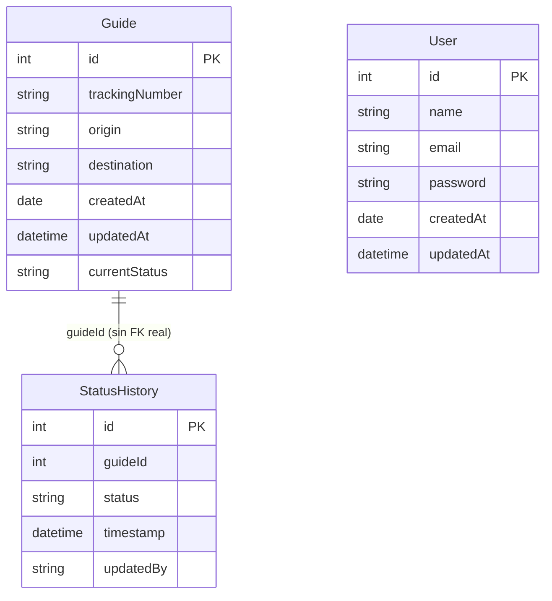

# 28 — Fundamentos de bases de datos: SQL, DBMS y modelos (Módulo 67 de la plataforma)

Temas: qué es un DBMS, el estándar ANSI SQL, los distintos modelos de bases de datos
(relacional, NoSQL, orientado a objetos, distribuida), diagramas de entidad-relación,
y las herramientas del ecosistema SQL Server (SSMS, Adventure Works). Es el módulo
más "de fondo" de todos — la teoría de bases de datos que ya veníamos usando sin
nombrarla, desde el primer `makemigrations` de este proyecto.

## Glosario del módulo

| Término | Definición corta | Dónde se explica aquí |
|---------|--------------------|---------------------------|
| **ANSI SQL** | Estándar de SQL para que funcione igual entre distintos DBMS | [ANSI SQL: por qué el SQL es "portable"](#ansi-sql-por-qué-el-sql-es-portable) |
| **Base de datos distribuida** | Datos repartidos en varias ubicaciones físicas, gestionados como uno solo | [Los 4 modelos de base de datos](#los-4-modelos-de-base-de-datos) |
| **DBMS** | Software que crea/gestiona/manipula bases de datos | [Qué es un DBMS](#qué-es-un-dbms) |
| **Diagrama de entidad-relación** | Representación gráfica de tablas y sus relaciones | [El diagrama de entidad-relación de Hound Express](#el-diagrama-de-entidad-relación-de-hound-express) |
| **IDE** | Entorno de desarrollo integrado (editor + debugger + build) | [IDE vs herramienta de base de datos](#ide-vs-herramienta-de-base-de-datos) |
| **Modelo orientado a objetos** | Representa datos como objetos, no como filas/tablas | [Los 4 modelos de base de datos](#los-4-modelos-de-base-de-datos) |
| **NoSQL** | DBMS sin el modelo relacional tradicional, para datos no estructurados | [Los 4 modelos de base de datos](#los-4-modelos-de-base-de-datos) |
| **PostgreSQL** | DBMS relacional de código abierto | [SQLite (lo que usamos) vs PostgreSQL/SQL Server](#sqlite-lo-que-usamos-vs-postgresqlsql-server) |
| **SQL Server** | DBMS relacional de Microsoft | [SQLite (lo que usamos) vs PostgreSQL/SQL Server](#sqlite-lo-que-usamos-vs-postgresqlsql-server) |
| **SSMS** | Herramienta gráfica de Microsoft para administrar SQL Server | [IDE vs herramienta de base de datos](#ide-vs-herramienta-de-base-de-datos) |

---

## Qué es un DBMS

**DBMS** (*Database Management System*) es el software que se encarga de crear,
guardar, consultar y proteger los datos — tú casi nunca tocas los archivos de la base
de datos directamente, siempre hablas con el DBMS (vía SQL, o vía el ORM de Django,
que a su vez le habla al DBMS por ti). Ejemplos de DBMS: SQLite, PostgreSQL,
SQL Server, MySQL — todos hacen lo mismo en esencia, con diferencias de
rendimiento, escalabilidad y características extra.

**Este proyecto ya usa uno**, aunque no lo hayamos nombrado como tal:
`hound_express/settings.py` define `DATABASES['default']['ENGINE'] =
'django.db.backends.sqlite3'` — SQLite es nuestro DBMS. Django habla con él a través
del ORM; nosotros nunca escribimos SQL a mano en este proyecto (aunque si quisiéramos
ver el SQL real que genera una migración, ya vimos cómo con `sqlmigrate` en
[docs/14](14-modelos-y-migraciones.md#141-cambios-en-los-modelos-y-qué-son-las-migraciones)).

## ANSI SQL: por qué el SQL es "portable"

SQL en sí es un lenguaje **estandarizado** por ANSI (American National Standards
Institute) — por eso una consulta básica como:

```sql
SELECT Name, Price FROM Products WHERE Price > 100;
```

se ve prácticamente igual en SQLite, PostgreSQL, SQL Server o MySQL. En la
práctica, cada DBMS agrega sus propias extensiones más allá del estándar (funciones
propias, tipos de dato específicos), pero el núcleo —`SELECT`, `WHERE`, `JOIN`,
`GROUP BY`— es el mismo en todos. Es la misma idea de "estándar compartido" que ya
vimos con HTTP y REST en [docs/22](22-rest-apis-fundamentos.md) — un lenguaje común
que hace que las herramientas sean intercambiables hasta cierto punto.

## Tipos de bases de datos: cuándo usar cada uno

La lista "oficial" es larga (relacional, data warehouse, NoSQL, orientada a objetos,
distribuida, de grafos, de series de tiempo...), pero en el día a día **casi todo**
se resuelve con 2-3 de estos tipos. Van ordenados de más a menos comunes en el
mercado laboral real, con el escenario que resuelve cada uno y ejemplos concretos.

### 1. Relacional — la más usada, por mucho

**Cuándo usarla**: cuando tus datos tienen una forma fija y predecible (columnas
conocidas de antemano) y las relaciones **entre** entidades importan tanto como los
datos en sí — pedidos que pertenecen a clientes, empleados que pertenecen a
departamentos. Es la opción por default salvo que tengas una razón concreta para
otra cosa.

**Por qué es la más usada**: garantiza integridad (no puedes tener un pedido
"huérfano" sin cliente si defines la relación bien), tiene décadas de herramientas y
gente que sabe usarla, y SQL —el lenguaje para consultarla— es una habilidad
transferible entre casi cualquier trabajo de backend.

**Ejemplos**: Hound Express (este proyecto, con SQLite); un banco llevando cuentas y
transacciones (necesita integridad absoluta — no puede "perder" una transacción);
sistemas de inventario y ERP empresariales, casi siempre sobre SQL Server, Oracle o
PostgreSQL.

### 2. NoSQL — la segunda más usada, para lo que no encaja en tablas

**Cuándo usarla**: datos sin forma fija (cada "cliente" puede tener campos
distintos), volúmenes masivos donde escalar horizontalmente (agregar más servidores)
importa más que las relaciones estrictas, o necesitas velocidad de lectura/escritura
extrema sobre estructuras simples.

**Por qué es tan usada hoy**: aplicaciones modernas (redes sociales, IoT, catálogos
con atributos variables por producto) generan datos que no siempre caben cómodos en
una tabla rígida, y NoSQL sacrifica algunas garantías de integridad a cambio de
flexibilidad y escala.

**Subtipos y ejemplos reales**:
- **Documentos** (MongoDB): catálogos de e-commerce donde cada producto tiene
  atributos distintos (una playera tiene talla/color, un libro tiene autor/ISBN).
- **Clave-valor** (Redis): cachés y sesiones de usuario — lecturas/escrituras
  brutalmente rápidas de pares simples `clave → valor`.
- **Columnar** (Cassandra): métricas e IoT con escrituras masivas y constantes.

### 3. Data Warehouse — para analizar, no para operar

**Cuándo usarla**: cuando ya tienes datos operativos (en una o varias bases
relacionales distintas) y necesitas **analizarlos** — reportes, tendencias, tableros
ejecutivos — sin que esas consultas pesadas (que escanean millones de filas)
afecten el rendimiento del sistema que atiende a los clientes en tiempo real.

**Por qué existe como categoría aparte**: una base operativa (**OLTP**,
*Online Transaction Processing* — muchas escrituras pequeñas, como crear un pedido)
está optimizada para algo distinto a un data warehouse (**OLAP**,
*Online Analytical Processing* — pocas consultas, pero gigantescas, sobre años de
historial). Mezclar ambos usos en la misma base los hace lentos a los dos.

**Ejemplo real**: una tienda en línea usa una base relacional normal para procesar
pedidos al momento (rápida, siempre disponible), y periódicamente copia esos datos a
un data warehouse (Snowflake, Amazon Redshift, Google BigQuery) donde el equipo de
analítica corre consultas de "ventas por región en los últimos 3 años" sin arriesgar
la base que atiende a los clientes reales.

#### Data Warehouse vs Data Lake vs base de datos operativa

Vale la pena distinguir un tercer concepto que se confunde seguido con el data
warehouse: el **data lake**. Los tres resuelven necesidades distintas, en distintas
etapas del ciclo de vida del dato:

| | Base de datos operativa | Data Warehouse | Data Lake |
|---|---|---|---|
| **Qué guarda** | Datos actuales, "vivos", del negocio operando ahora mismo | Datos históricos, ya limpios y modelados | Datos crudos, en su formato original, de cualquier tipo |
| **Estructura** | Esquema fijo, definido antes de guardar (`schema-on-write`) | Esquema fijo, pensado para análisis (tablas de hechos/dimensiones) | Sin esquema al guardar — se le da forma al leerlo (`schema-on-read`) |
| **Tipo de dato** | Estructurado (filas/columnas) | Estructurado | Estructurado, semi-estructurado (JSON, logs) y no estructurado (imágenes, video, texto libre) |
| **Para quién** | La aplicación misma (crear/leer/actualizar en el momento) | Analistas de negocio, reportes, BI | Científicos/ingenieros de datos, Machine Learning |
| **Ejemplo** | La base de Hound Express (SQLite) atendiendo la API en vivo | El mismo negocio, con 3 años de historial ya limpio para Power BI/Tableau | Todos los logs crudos del servidor, clics de usuarios, imágenes subidas — guardados tal cual, "por si acaso" se necesitan después |

**La diferencia que más importa**: un data warehouse **ya decidió** qué forma
tendrán los datos antes de guardarlos (limpios, filtrados, listos para un reporte
específico) — es rígido pero rápido de consultar. Un data lake guarda **todo, tal
cual llega**, sin decidir su forma de antemano — es barato y flexible, pero requiere
más trabajo (y las herramientas correctas) para sacarle valor después, porque nadie
garantiza que los datos ahí dentro estén limpios o completos.

**Cuándo elegir cada uno**: si ya sabes exactamente qué preguntas de negocio vas a
responder de forma repetida (ventas mensuales, por ejemplo) → data warehouse. Si no
sabes todavía qué se va a analizar y prefieres guardar todo por si acaso (típico
antes de meterle Machine Learning a algo) → data lake. Un proyecto como Hound
Express, en su tamaño actual, no necesita ninguno de los dos — su única base
operativa (SQLite) es suficiente.

### 4. Orientada a objetos — nicho, cuando el dominio ya es "de objetos"

**Cuándo usarla**: cuando el modelo de tu aplicación es tan naturalmente
orientado a objetos (con herencia, comportamiento complejo pegado a los datos) que
traducirlo a filas y columnas se vuelve más trabajo que beneficio.

**Por qué es poco común hoy**: la mayoría de esos casos se resuelven bien con un
ORM (como el de Django) sobre una base relacional normal — tienes "objetos" del
lado de tu código Python, pero la base de datos sigue siendo tablas por debajo. Una
base de datos orientada a objetos real (donde se guarda el objeto tal cual, sin
traducirlo) es rara fuera de software muy especializado.

**Ejemplo**: software de diseño CAD/ingeniería, donde los objetos son estructuras
muy complejas y anidadas que no vale la pena aplanar a tablas.

### 5. Distribuida — para escalar más allá de un solo servidor

**Cuándo usarla**: cuando el volumen de datos o tráfico ya no cabe (o no es
confiable) en un solo servidor, o necesitas que los datos vivan cerca de usuarios en
distintas regiones del mundo para que la app responda rápido en todos lados.

**Ejemplo**: aplicaciones globales (Cassandra en Netflix, CockroachDB para bancos
multi-región) donde perder un servidor no debe tumbar el servicio, y donde un
usuario en Japón y otro en México deben tener latencia baja por igual.

### Otros tipos que existen (el "Etc." de la consigna)

- **De grafos** (Neo4j): cuando lo que importa son las **conexiones** entre datos,
  no los datos en sí — redes sociales ("amigos de amigos"), motores de
  recomendación, detección de fraude por patrones de conexión.
- **De series de tiempo** (InfluxDB, TimescaleDB): métricas con marca de tiempo a
  altísima frecuencia — monitoreo de servidores, sensores IoT, precios de bolsa.

### Resumen: por qué Hound Express usa relacional

Nuestros datos son tabulares por naturaleza (una guía tiene campos fijos:
`trackingNumber`, `origin`, `destination`...) y las relaciones entre entidades
(`Estatus` referencia una `Guia`) son justo lo que el modelo relacional resuelve
bien de fábrica. No hay volumen masivo, ni datos sin forma fija, ni necesidad de
analítica pesada separada — así que ir a NoSQL o un data warehouse sería complejidad
sin beneficio real para este proyecto.

## `SQLite` (lo que usamos) vs `PostgreSQL`/`SQL Server`

Los tres son DBMS **relacionales** — hablan el mismo SQL de fondo — pero para casos
de uso distintos:

| | SQLite | PostgreSQL | SQL Server |
|---|--------|--------------|--------------|
| Dónde vive | Un solo archivo (`db.sqlite3`) | Proceso servidor aparte | Proceso servidor aparte |
| Setup | Cero configuración — Django ya lo trae de default | Requiere instalar y correr el servidor | Requiere instalar y correr el servidor |
| Concurrencia | Limitada (varios procesos escribiendo a la vez pueden toparse) | Alta | Alta |
| Cuándo usarlo | Desarrollo local, apps pequeñas, prototipos | Producción, apps con tráfico real | Producción, sobre todo en entornos ya basados en Microsoft |
| Licencia | Dominio público | Código abierto | Comercial (con edición gratuita limitada) |

**Por qué Hound Express usa SQLite y no algo más "serio"**: para una entrega de
curso, sin usuarios concurrentes reales, SQLite es la opción de cero fricción — no
hay que instalar ni levantar un servidor de base de datos aparte. El cambio a
PostgreSQL, si este proyecto fuera a producción, sería literalmente **una sola
línea** en `settings.py` (cambiar `ENGINE` y agregar host/usuario/contraseña) — el
ORM y los modelos no cambian en absoluto, que es justo la ventaja de que Django
hable "SQL genérico" a través del ORM en vez de SQL específico de un motor.

## `IDE` vs herramienta de base de datos

Un **IDE** (editor + debugger + herramientas de build, como VS Code o PyCharm) es
para escribir **código**. **SSMS** (SQL Server Management Studio) es su equivalente,
pero para administrar **bases de datos**: ejecutar consultas SQL, ver tablas,
diseñar diagramas de entidad-relación, gestionar permisos — todo con interfaz
gráfica, sin escribir cada comando a mano en una terminal.

Django tiene su propio equivalente más liviano para esto: el **admin de Django**
(`/admin/`, ver [docs/14](14-modelos-y-migraciones.md#django-admin-refleja-tus-modelos-automáticamente))
resuelve una versión simplificada de lo mismo — ver y editar datos con interfaz
gráfica — aunque no llega al nivel de SSMS para diseñar la estructura de la base de
datos en sí.

## El diagrama de entidad-relación de Hound Express

Ya construimos uno informalmente en [DOCUMENTACION.md](../DOCUMENTACION.md) — aquí
va formalizado con el vocabulario correcto del módulo:



La nota "sin FK real" es intencional: como vimos en
[docs/13](13-vistas-crud-y-consultas.md) y [docs/17](17-ordenes-facturacion-y-senales.md),
`StatusHistory.guideId` es un entero simple, no una llave foránea declarada a nivel
de base de datos — una decisión explícita de esa entrega, distinta a como se
modelaría normalmente una relación en un diagrama de entidad-relación "de libro de
texto" (que sí esperaría una FK real ahí).

## Bases de datos de ejemplo: el rol de Adventure Works

Adventure Works es una base de datos de ejemplo que da Microsoft, ya poblada con
datos realistas (productos, clientes, ventas) — sirve para **practicar SQL sin tener
que diseñar ni llenar una base de datos desde cero**. Es el mismo propósito que
cumplen, en este curso, los **fixtures** que ya vimos en
[docs/14](14-modelos-y-migraciones.md#fixtures): datos de prueba listos, para no
tener que capturar todo a mano antes de poder practicar.

---

## Autoevaluación (Módulo 67)

1. **¿Qué modelos de bases de datos explora el curso?**
   Relacional, NoSQL, orientado a objetos y distribuida. → [Los 4 modelos de base de datos](#los-4-modelos-de-base-de-datos)

2. **¿Qué herramientas se instalan en este módulo?**
   SQL Server 2019 y SQL Server Management Studio (SSMS).

3. **¿Qué es Adventure Works y por qué importa?**
   Base de datos de ejemplo de Microsoft, con datos ya poblados, para practicar SQL
   sin crear información desde cero. → [Bases de datos de ejemplo: el rol de Adventure Works](#bases-de-datos-de-ejemplo-el-rol-de-adventure-works)

4. **¿Cómo se usa Adventure Works en el módulo?**
   Se descarga y restaura con SSMS, y se revisa su diagrama de entidad-relación para
   entender cómo están conectadas sus tablas.

## Ejemplo de uso en el mercado laboral

- **Retail**: SQL sobre grandes volúmenes de datos de ventas/clientes, para
  decisiones de inventario y marketing.
- **Sector financiero**: bases de datos relacionales robustas (SQL Server,
  PostgreSQL) para transacciones donde la integridad de los datos es crítica —
  justo el tipo de garantías que da el modelo relacional frente a NoSQL.
