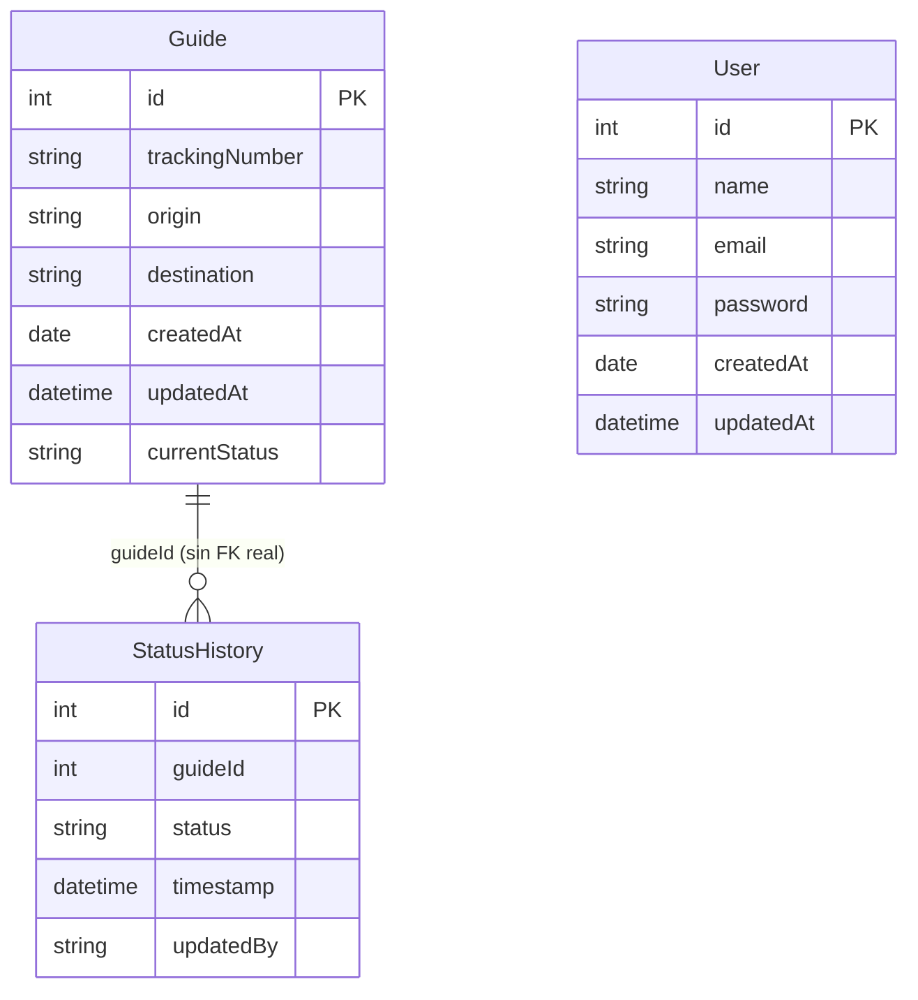

# 28 — Fundamentos de bases de datos: SQL, DBMS y modelos (Módulo 67 de la plataforma)

Temas: qué es un DBMS, el estándar ANSI SQL, los distintos modelos de bases de datos
(relacional, NoSQL, orientado a objetos, distribuida), diagramas de entidad-relación,
y las herramientas del ecosistema SQL Server (SSMS, Adventure Works). Es el módulo
más "de fondo" de todos — la teoría de bases de datos que ya veníamos usando sin
nombrarla, desde el primer `makemigrations` de este proyecto.

## Glosario del módulo

| Término | Definición corta | Dónde se explica aquí |
|---------|--------------------|---------------------------|
| **ANSI SQL** | Estándar de SQL para que funcione igual entre distintos DBMS | [ANSI SQL: por qué el SQL es "portable"](#ansi-sql-por-qué-el-sql-es-portable) |
| **Base de datos distribuida** | Datos repartidos en varias ubicaciones físicas, gestionados como uno solo | [Los 4 modelos de base de datos](#los-4-modelos-de-base-de-datos) |
| **DBMS** | Software que crea/gestiona/manipula bases de datos | [Qué es un DBMS](#qué-es-un-dbms) |
| **Diagrama de entidad-relación** | Representación gráfica de tablas y sus relaciones | [El diagrama de entidad-relación de Hound Express](#el-diagrama-de-entidad-relación-de-hound-express) |
| **IDE** | Entorno de desarrollo integrado (editor + debugger + build) | [IDE vs herramienta de base de datos](#ide-vs-herramienta-de-base-de-datos) |
| **Modelo orientado a objetos** | Representa datos como objetos, no como filas/tablas | [Los 4 modelos de base de datos](#los-4-modelos-de-base-de-datos) |
| **NoSQL** | DBMS sin el modelo relacional tradicional, para datos no estructurados | [Los 4 modelos de base de datos](#los-4-modelos-de-base-de-datos) |
| **PostgreSQL** | DBMS relacional de código abierto | [SQLite (lo que usamos) vs PostgreSQL/SQL Server](#sqlite-lo-que-usamos-vs-postgresqlsql-server) |
| **SQL Server** | DBMS relacional de Microsoft | [SQLite (lo que usamos) vs PostgreSQL/SQL Server](#sqlite-lo-que-usamos-vs-postgresqlsql-server) |
| **SSMS** | Herramienta gráfica de Microsoft para administrar SQL Server | [IDE vs herramienta de base de datos](#ide-vs-herramienta-de-base-de-datos) |

---

## Qué es un DBMS

**DBMS** (*Database Management System*) es el software que se encarga de crear,
guardar, consultar y proteger los datos — tú casi nunca tocas los archivos de la base
de datos directamente, siempre hablas con el DBMS (vía SQL, o vía el ORM de Django,
que a su vez le habla al DBMS por ti). Ejemplos de DBMS: SQLite, PostgreSQL,
SQL Server, MySQL — todos hacen lo mismo en esencia, con diferencias de
rendimiento, escalabilidad y características extra.

**Este proyecto ya usa uno**, aunque no lo hayamos nombrado como tal:
`hound_express/settings.py` define `DATABASES['default']['ENGINE'] =
'django.db.backends.sqlite3'` — SQLite es nuestro DBMS. Django habla con él a través
del ORM; nosotros nunca escribimos SQL a mano en este proyecto (aunque si quisiéramos
ver el SQL real que genera una migración, ya vimos cómo con `sqlmigrate` en
[docs/14](14-modelos-y-migraciones.md#141-cambios-en-los-modelos-y-qué-son-las-migraciones)).

## ANSI SQL: por qué el SQL es "portable"

SQL en sí es un lenguaje **estandarizado** por ANSI (American National Standards
Institute) — por eso una consulta básica como:

```sql
SELECT Name, Price FROM Products WHERE Price > 100;
```

se ve prácticamente igual en SQLite, PostgreSQL, SQL Server o MySQL. En la
práctica, cada DBMS agrega sus propias extensiones más allá del estándar (funciones
propias, tipos de dato específicos), pero el núcleo —`SELECT`, `WHERE`, `JOIN`,
`GROUP BY`— es el mismo en todos. Es la misma idea de "estándar compartido" que ya
vimos con HTTP y REST en [docs/22](22-rest-apis-fundamentos.md) — un lenguaje común
que hace que las herramientas sean intercambiables hasta cierto punto.

## Los 4 modelos de base de datos

| Modelo | Cómo organiza los datos | Ejemplo |
|--------|----------------------------|-----------|
| **Relacional** | Tablas con filas/columnas, relacionadas por llaves foráneas | SQLite, PostgreSQL, SQL Server — lo que usa este proyecto |
| **NoSQL** | Documentos, pares clave-valor, grafos o columnas anchas — sin esquema rígido de tablas | MongoDB (documentos), Redis (clave-valor) |
| **Orientado a objetos** | Guarda objetos directamente (con su comportamiento), no solo filas de datos | Menos común hoy; útil cuando el modelo de datos ya es muy "de objetos" en la aplicación |
| **Distribuida** | Los datos viven repartidos en varios servidores/ubicaciones, pero se ven como una sola base | Cassandra, CockroachDB — para escalar más allá de lo que aguanta un solo servidor |

**Por qué elegimos relacional para Hound Express**: nuestros datos son tabulares por
naturaleza (una guía tiene campos fijos: `trackingNumber`, `origin`, `destination`...)
y las relaciones entre entidades (`Estatus` apunta a una `Guia`) son exactamente lo
que el modelo relacional resuelve bien de fábrica, con integridad y consultas
estructuradas — no había necesidad de algo más especializado como NoSQL, que brilla
más con datos sin forma fija o volúmenes masivos que no caben cómodo en tablas.

## `SQLite` (lo que usamos) vs `PostgreSQL`/`SQL Server`

Los tres son DBMS **relacionales** — hablan el mismo SQL de fondo — pero para casos
de uso distintos:

| | SQLite | PostgreSQL | SQL Server |
|---|--------|--------------|--------------|
| Dónde vive | Un solo archivo (`db.sqlite3`) | Proceso servidor aparte | Proceso servidor aparte |
| Setup | Cero configuración — Django ya lo trae de default | Requiere instalar y correr el servidor | Requiere instalar y correr el servidor |
| Concurrencia | Limitada (varios procesos escribiendo a la vez pueden toparse) | Alta | Alta |
| Cuándo usarlo | Desarrollo local, apps pequeñas, prototipos | Producción, apps con tráfico real | Producción, sobre todo en entornos ya basados en Microsoft |
| Licencia | Dominio público | Código abierto | Comercial (con edición gratuita limitada) |

**Por qué Hound Express usa SQLite y no algo más "serio"**: para una entrega de
curso, sin usuarios concurrentes reales, SQLite es la opción de cero fricción — no
hay que instalar ni levantar un servidor de base de datos aparte. El cambio a
PostgreSQL, si este proyecto fuera a producción, sería literalmente **una sola
línea** en `settings.py` (cambiar `ENGINE` y agregar host/usuario/contraseña) — el
ORM y los modelos no cambian en absoluto, que es justo la ventaja de que Django
hable "SQL genérico" a través del ORM en vez de SQL específico de un motor.

## `IDE` vs herramienta de base de datos

Un **IDE** (editor + debugger + herramientas de build, como VS Code o PyCharm) es
para escribir **código**. **SSMS** (SQL Server Management Studio) es su equivalente,
pero para administrar **bases de datos**: ejecutar consultas SQL, ver tablas,
diseñar diagramas de entidad-relación, gestionar permisos — todo con interfaz
gráfica, sin escribir cada comando a mano en una terminal.

Django tiene su propio equivalente más liviano para esto: el **admin de Django**
(`/admin/`, ver [docs/14](14-modelos-y-migraciones.md#django-admin-refleja-tus-modelos-automáticamente))
resuelve una versión simplificada de lo mismo — ver y editar datos con interfaz
gráfica — aunque no llega al nivel de SSMS para diseñar la estructura de la base de
datos en sí.

## El diagrama de entidad-relación de Hound Express

Ya construimos uno informalmente en [DOCUMENTACION.md](../DOCUMENTACION.md) — aquí
va formalizado con el vocabulario correcto del módulo:



La nota "sin FK real" es intencional: como vimos en
[docs/13](13-vistas-crud-y-consultas.md) y [docs/17](17-ordenes-facturacion-y-senales.md),
`StatusHistory.guideId` es un entero simple, no una llave foránea declarada a nivel
de base de datos — una decisión explícita de esa entrega, distinta a como se
modelaría normalmente una relación en un diagrama de entidad-relación "de libro de
texto" (que sí esperaría una FK real ahí).

## Bases de datos de ejemplo: el rol de Adventure Works

Adventure Works es una base de datos de ejemplo que da Microsoft, ya poblada con
datos realistas (productos, clientes, ventas) — sirve para **practicar SQL sin tener
que diseñar ni llenar una base de datos desde cero**. Es el mismo propósito que
cumplen, en este curso, los **fixtures** que ya vimos en
[docs/14](14-modelos-y-migraciones.md#fixtures): datos de prueba listos, para no
tener que capturar todo a mano antes de poder practicar.

---

## Autoevaluación (Módulo 67)

1. **¿Qué modelos de bases de datos explora el curso?**
   Relacional, NoSQL, orientado a objetos y distribuida. → [Los 4 modelos de base de datos](#los-4-modelos-de-base-de-datos)

2. **¿Qué herramientas se instalan en este módulo?**
   SQL Server 2019 y SQL Server Management Studio (SSMS).

3. **¿Qué es Adventure Works y por qué importa?**
   Base de datos de ejemplo de Microsoft, con datos ya poblados, para practicar SQL
   sin crear información desde cero. → [Bases de datos de ejemplo: el rol de Adventure Works](#bases-de-datos-de-ejemplo-el-rol-de-adventure-works)

4. **¿Cómo se usa Adventure Works en el módulo?**
   Se descarga y restaura con SSMS, y se revisa su diagrama de entidad-relación para
   entender cómo están conectadas sus tablas.

## Ejemplo de uso en el mercado laboral

- **Retail**: SQL sobre grandes volúmenes de datos de ventas/clientes, para
  decisiones de inventario y marketing.
- **Sector financiero**: bases de datos relacionales robustas (SQL Server,
  PostgreSQL) para transacciones donde la integridad de los datos es crítica —
  justo el tipo de garantías que da el modelo relacional frente a NoSQL.
